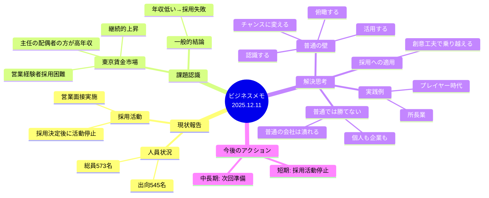
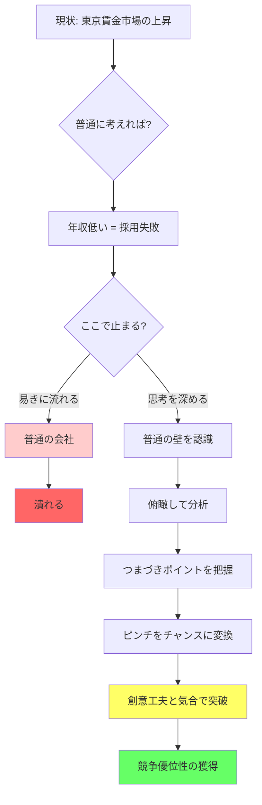
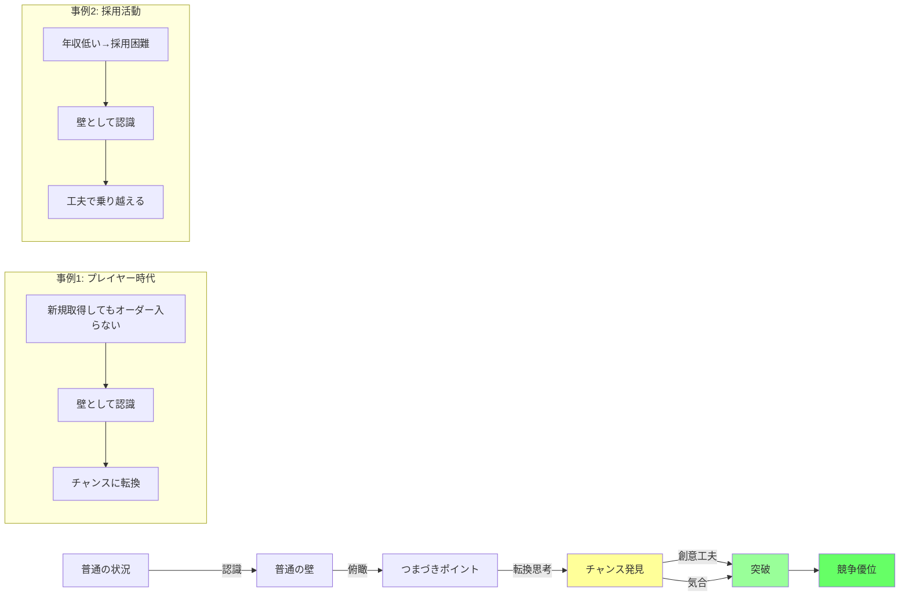
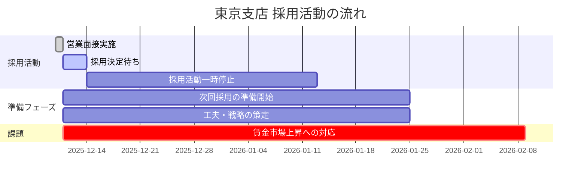
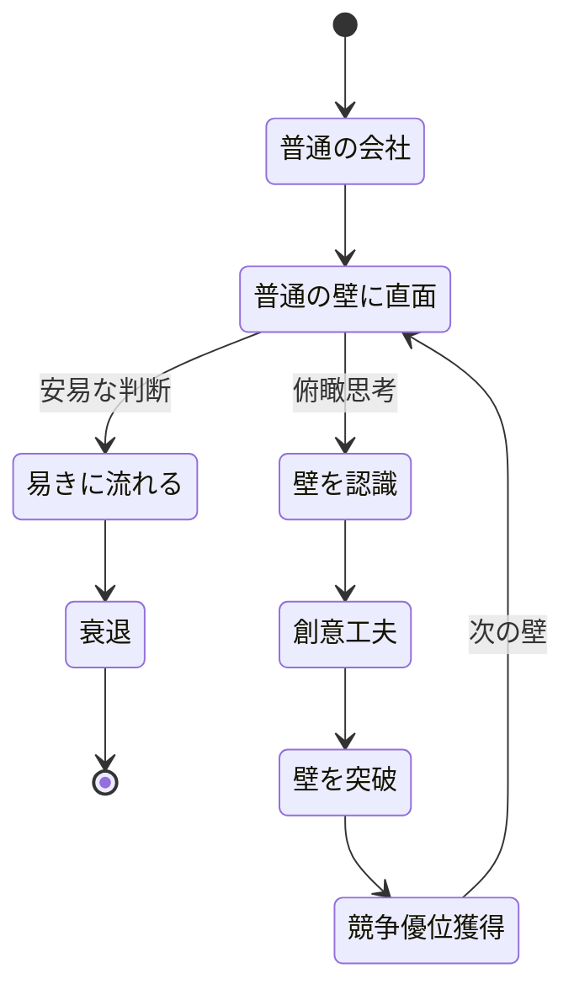
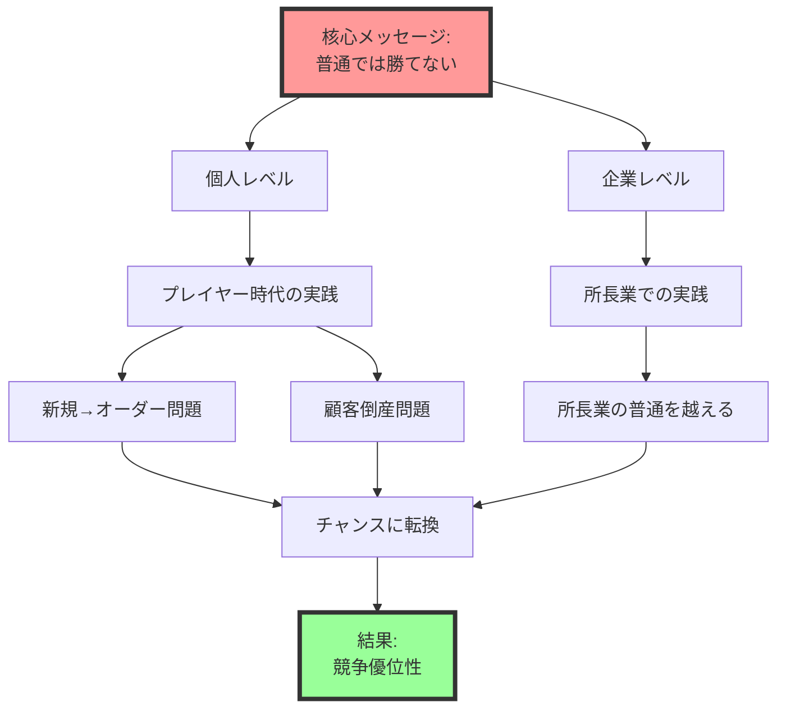
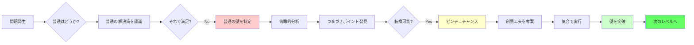

# ビジネスメモ プロット・図解

## 1. 全体構造マインドマップ

## 2. 思考プロセスのフローチャート

## 3. 「普通の壁」突破モデル

## 4. 採用活動のタイムライン

## 5. 組織の状態遷移図

## 6. 核心メッセージの構造

## 7. 課題と解決策のマトリクス

| 課題 | 普通の対応 | 普通を越える対応 | 期待される結果 |
|------|-----------|-----------------|--------------|
| 賃金市場の上昇 | 年収を上げる | 創意工夫で魅力を高める | 予算内で優秀な人材獲得 |
| 営業経験者不足 | 経験者に高給提示 | 未経験者育成+独自価値提案 | 忠誠心の高い人材育成 |
| 競合との差別化 | 条件で勝負 | 文化・哲学で勝負 | 持続的競争優位 |
| 主任の年収問題 | 一律昇給 | 価値創造による昇給 | 生産性向上+満足度向上 |

## 8. 北村の思考フレームワーク

